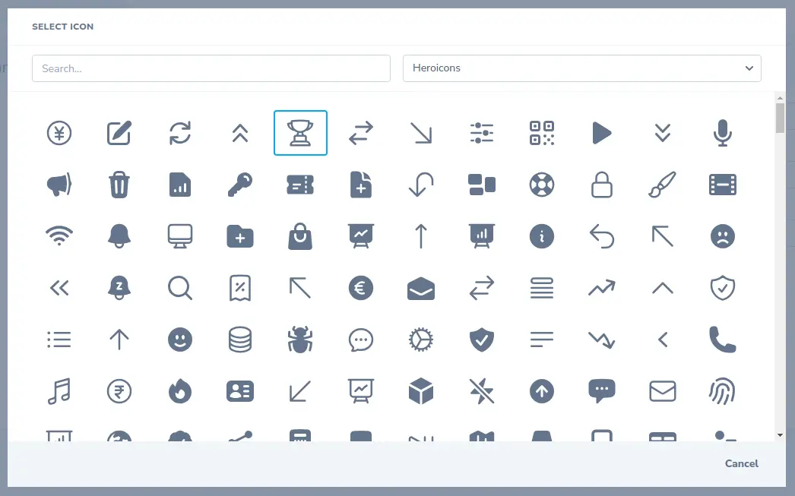

[](https://stand-with-ukraine.pp.ua)

# Icon Picker for Laravel Nova

[](https://packagist.org/packages/nevadskiy/nova-icon-picker)
[](https://packagist.org/packages/nevadskiy/nova-icon-picker)



## ✅ Requirements

- Laravel Nova 4
- PHP 8.0 or newer

## 🔌 Installation

Install the package via Composer:

```bash
composer require nevadskiy/nova-icon-picker
````

## 📄 Documentation

#### Persisting

The field simply stores icons as a string representing the icon's name.

#### Iconsets 

To add icons to the field, use the `iconset` method, which accepts the name of the iconset and the path to the directory with SVG icons. It is allowed to register multiple iconsets, but it requires defining unique prefixes so that icons can be resolved correctly.

#### Defining Field

To add a field to a resource, simply add it to resource's `fields` method:

```php
use Nevadskiy\Nova\IconPicker\IconPicker;

public function fields(): array
{
    return [
        IconPicker::make('Icon')
            ->iconset(
                name: 'General'
                path: resource_path('svg'), 
            ),
            ->iconset(
                name: 'Brands', 
                path: resource_path('svg/brands'), 
                prefix: 'brands/' 
            )
            ->indexSize(16)
            ->detailSize(32),
    ]
}
```

### Global configuration

It is also possible to configure the field via `ServiceProvider`:

```php
public function boot(): void
{
    IconPicker::configure(function (IconPicker $icon) {
        $icon->iconset(
            name: 'Solid',
            path: resource_path('svg/solid'),
            prefix: 'solid/',
        );
    
        $icon->iconset(
            name: 'Outline',
            path: resource_path('svg/outline'),
            prefix: 'outline/',
        );
    
        $icon->iconset(
            name: 'Brands',
            path: resource_path('svg/brands'),
            prefix: 'brands/',
        );
    });
}
```

## 📜 License

The MIT License (MIT). Please see [LICENSE](LICENSE) for more information.
